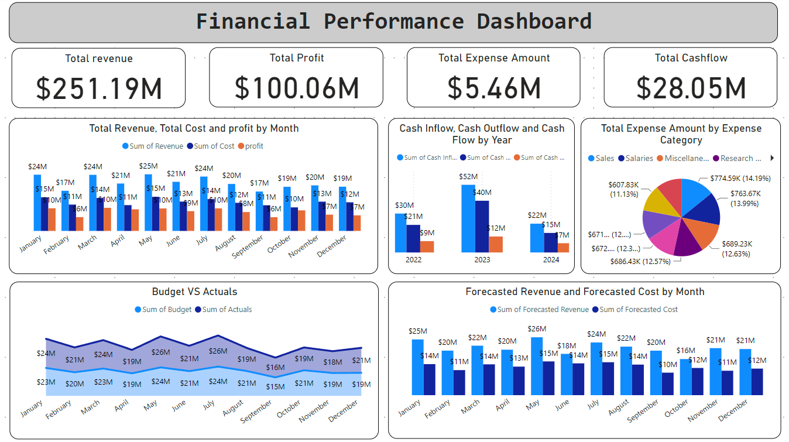

# Financial Performance Dashboard

## Objective
To provide a comprehensive view of financial performance metrics, including revenue, cost, profit margins, budget vs. actuals, expense breakdown, cash flow, and forecasting, to enable data-driven financial decision-making.

## Stakeholders
- **Finance Managers**: To monitor financial performance and profitability.
- **Executives and Leadership**: To gain insights into financial health and strategic planning.
- **Budget Analysts**: To compare budgeted figures against actuals and optimize budget allocations.
- **Accountants**: To track cash flow and ensure financial stability.

## Business Problems
- **Financial Performance Monitoring**: Need for real-time insights into revenue, costs, and profit margins.
- **Budget Management**: Challenges in tracking and comparing budgeted figures against actual performance.
- **Expense Management**: Difficulty in analyzing and optimizing various expense categories.
- **Cash Flow Analysis**: Ensuring positive cash flow and financial stability.
- **Revenue and Cost Forecasting**: Need for accurate forecasting to support strategic planning.

## Data Source
Generated sample data using Python with key metrics and dimensions necessary for financial performance analysis.

## Results
- **Revenue and Cost Analysis**: Insights into revenue, cost, and profit margins over time.
- **Budget vs. Actuals**: Comparison of budgeted figures against actual performance.
- **Expense Breakdown**: Detailed analysis of expenses by category.
- **Cash Flow Analysis**: Trends in cash inflow and outflow, and overall cash flow.
- **Forecasting**: Trend lines for forecasted revenue and costs.

This project demonstrates the application of data analytics and visualization techniques to gain valuable insights into financial performance, showcasing the ability to generate, analyze, and visualize data for improved financial decision-making.