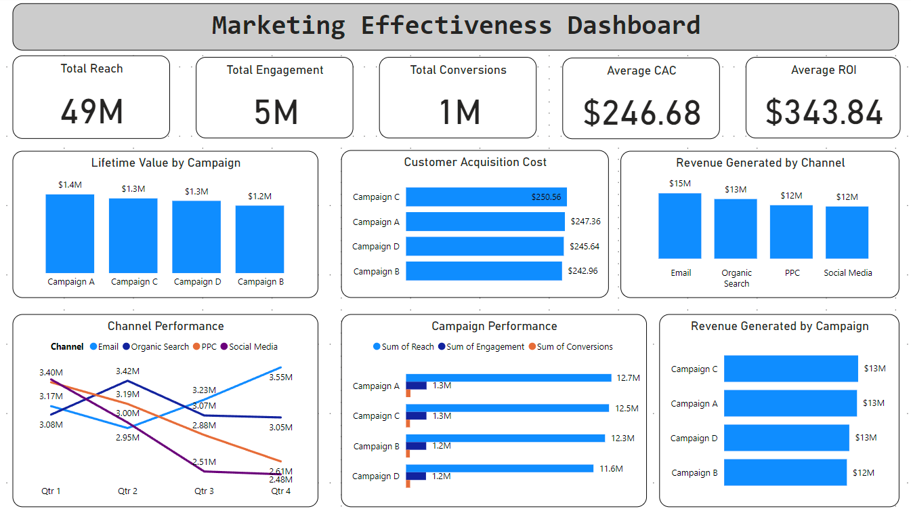

#### Marketing Effectiveness Dashboard

**Objective**: 
The objective of this project is to develop a Marketing Effectiveness Dashboard that provides comprehensive insights into the performance of marketing campaigns. This dashboard aims to help stakeholders understand campaign reach, engagement, conversions, ROI, channel performance, customer acquisition cost (CAC), and the lifetime value (LTV) of customers. By leveraging this data, decision-makers can optimize marketing strategies and allocate resources more effectively.

**Stakeholders**:
- **Marketing Managers**: To monitor and analyze the performance of marketing campaigns and channels.
- **Executives and Leadership**: To gain insights into the overall effectiveness and ROI of marketing efforts.
- **Sales Teams**: To understand customer acquisition metrics and improve sales strategies.
- **Data Analysts**: To identify trends and provide actionable insights for improving marketing performance.
- **Financial Analysts**: To assess the financial impact of marketing activities and optimize budgets.

**Business Problems**:
- **Campaign Performance**: Difficulty in tracking and analyzing the effectiveness of different marketing campaigns.
- **ROI Analysis**: Need for precise calculation and monitoring of the return on investment for marketing activities.
- **Channel Performance**: Understanding the performance of various marketing channels (email, social media, PPC, etc.) and their impact on overall marketing effectiveness.
- **Customer Acquisition Cost**: Challenges in measuring and optimizing the cost of acquiring new customers.
- **Lifetime Value**: Estimating and maximizing the lifetime value of customers to ensure long-term profitability.

**Data Source**: 
Generated sample data using Python with key metrics and dimensions necessary for marketing performance analysis, including campaign details, channel performance, reach, engagement, conversions, marketing spend, revenue generated, CAC, and LTV.

**Results**:
- **Campaign Performance Insights**: Detailed analysis of reach, engagement, and conversions for different campaigns.
- **ROI Analysis**: Accurate calculation of ROI for each campaign, helping to identify the most and least effective marketing efforts.
- **Channel Performance Comparison**: Visualization of performance metrics across different marketing channels.
- **Customer Acquisition Cost (CAC)**: Insights into the average cost of acquiring a customer, allowing for more efficient budget allocation.
- **Lifetime Value (LTV)**: Estimation of customer lifetime value, aiding in the development of strategies to maximize long-term profitability.

## Visualizations
- **Campaign Performance (Bar Chart)**: Reach, engagement, and conversions for different campaigns.
- **Channel Performance (Line Chart)**: Performance metrics across different marketing channels.
- **Customer Acquisition Cost (Bar Chart)**: Average CAC for different campaigns.
- **Lifetime Value (Bar Chart)**: Sum of LTV for different campaigns.
- **Conversion Rates (Funnel Chart)**: Conversion rates from reach to engagement to conversions.

## KPI Scorecards
- **Total Reach**
- **Total Engagement**
- **Total Conversions**
- **Average Customer Acquisition Cost (CAC)**
- **Average ROI**

By leveraging this Marketing Effectiveness Dashboard, Nestlé USA can gain valuable insights into their marketing efforts, optimize strategies, and improve overall marketing efficiency and effectiveness.
