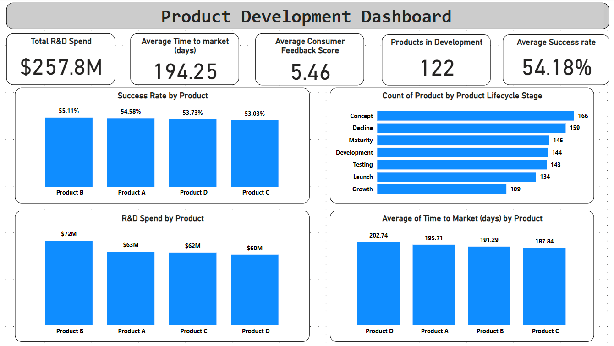

## Project Title: Product Development Dashboard

### Project Description

The Product Development Dashboard is a comprehensive data visualization project aimed at providing actionable insights into the product development process. This project leverages key metrics such as R&D spend, product success rates, time-to-market, consumer feedback scores, innovation pipeline status, and product lifecycle stages. The dashboard is designed to help stakeholders understand the efficiency and effectiveness of their product development efforts, identify areas for improvement, and make informed decisions to drive business growth.

### Objectives

1. **Monitor R&D Spend vs. Product Success Rates**:
   - Track the financial investment in research and development and correlate it with the success rates of different products.
   
2. **Analyze Time-to-Market for New Products**:
   - Measure the time taken to bring new products from concept to market and identify bottlenecks in the development process.
   
3. **Evaluate Consumer Testing Feedback**:
   - Collect and analyze consumer feedback scores to gauge market reception and potential improvements for new products.
   
4. **Track Innovation Pipeline Status**:
   - Visualize the status of products in the innovation pipeline to ensure a balanced and timely flow of new product introductions.
   
5. **Conduct Product Lifecycle Analysis**:
   - Examine the stages of product lifecycles to optimize product portfolio management and maximize profitability.

### Stakeholders

- **Product Development Teams**:
  - Use insights to streamline development processes, reduce time-to-market, and improve product quality.
  
- **R&D Managers**:
  - Monitor R&D investments and correlate with product success rates to justify budgets and optimize resource allocation.
  
- **Marketing Teams**:
  - Understand consumer preferences and feedback to tailor marketing strategies and enhance product launches.
  
- **Executive Management**:
  - Gain a high-level overview of the product development pipeline and lifecycle stages to make strategic business decisions.
  
- **Investors and Financial Analysts**:
  - Assess the effectiveness of R&D investments and the potential for product success to inform investment decisions.

### Business Problems

1. **High R&D Costs with Uncertain Returns**:
   - Difficulty in correlating R&D spend with product success, leading to inefficient allocation of resources.
   
2. **Lengthy Time-to-Market**:
   - Prolonged development cycles delaying product launches and reducing competitive advantage.
   
3. **Inadequate Consumer Feedback Integration**:
   - Lack of actionable insights from consumer testing affecting product quality and market fit.
   
4. **Unclear Innovation Pipeline Status**:
   - Poor visibility into the status of products in the development pipeline, causing misalignment in planning and execution.
   
5. **Suboptimal Product Lifecycle Management**:
   - Inability to effectively manage product lifecycles, resulting in missed opportunities and suboptimal profitability.

### Results

- **Improved R&D Efficiency**:
  - Enhanced ability to correlate R&D spend with product success rates, leading to more informed investment decisions and optimized resource allocation.
  
- **Reduced Time-to-Market**:
  - Identification and elimination of bottlenecks in the development process, accelerating time-to-market for new products.
  
- **Better Consumer Feedback Utilization**:
  - Comprehensive analysis of consumer feedback scores enabling iterative improvements and higher product quality.
  
- **Enhanced Pipeline Management**:
  - Clear visualization of the innovation pipeline status ensuring timely and balanced product introductions.
  
- **Optimized Product Lifecycle Management**:
  - Effective tracking of product lifecycle stages enabling better portfolio management and maximized profitability.

### Key Visualizations

1. **R&D Spend vs. Success Rates (Bar Chart)**:
   - Visualizes the financial investment in R&D against the success rates of products.

2. **Average Time-to-Market by Product (Bar Chart)**:
   - Shows the average time taken to bring new products to market for each product.

3. **Consumer Feedback Scores by Product (Bar Chart)**:
   - Displays the average consumer feedback scores for each product.

4. **Innovation Pipeline Status (Kanban Board)**:
   - Visualizes the status of products in the innovation pipeline, providing a clear overview of the development stages.

### Conclusion

The Product Development Dashboard provides a powerful tool for visualizing and analyzing key metrics in the product development lifecycle. By offering actionable insights into R&D spend, product success rates, time-to-market, consumer feedback, and pipeline status, this project enables stakeholders to optimize their product development strategies and drive business growth. The comprehensive approach and user-friendly visualizations make it an invaluable resource for product development teams, R&D managers, marketing teams, and executive management.