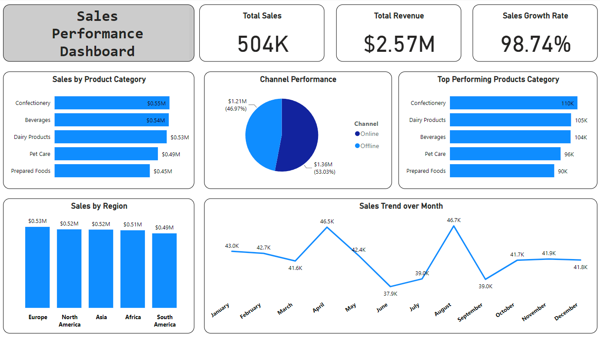

### Project Description: Sales Performance Dashboard

#### Objectives:
The primary objective of this project is to create a comprehensive Sales Performance Dashboard using Power BI. The dashboard aims to provide actionable insights into sales performance across various dimensions such as product categories, regions, and sales channels. By leveraging data analytics, the dashboard will enable stakeholders to make informed decisions to drive business growth and efficiency.

#### Stakeholders:
- **Sales and Marketing Teams**: To monitor and analyze sales performance and marketing effectiveness.
- **Regional Managers**: To track regional sales trends and identify areas for improvement.
- **Product Managers**: To understand the performance of different product categories and plan product strategies.
- **Executive Leadership**: To gain high-level insights into overall sales performance and growth trends.
- **Data Analysts**: To continuously update, refine, and derive insights from the dashboard.

#### Business Problems:
- **Lack of Visibility**: Difficulty in tracking and analyzing sales performance across different regions and channels.
- **Data Silos**: Fragmented data sources making it challenging to get a unified view of sales performance.
- **Inefficient Decision-Making**: Delayed and uninformed decision-making due to lack of real-time insights.
- **Resource Allocation**: Challenges in identifying top-performing products and regions, leading to suboptimal allocation of resources.

#### Project Description:
This project involves the creation of a Sales Performance Dashboard using Power BI to address the business problems identified. The dashboard integrates various data sources to provide a unified view of sales metrics, including total sales volume, revenue, sales by product category, sales by region, and channel performance. Advanced visualizations such as line charts, bar charts, pie charts, and heatmaps are utilized to present the data in a clear and actionable manner.

#### Data Source:
The sample data for this project was generated using Python, incorporating key metrics and dimensions necessary for comprehensive sales analysis. The dataset includes 1000 rows with columns such as Date, Region, Product Category, Channel, Sales Volume, and Revenue.

#### Results:
The Sales Performance Dashboard successfully provides:
- **Real-Time Insights**: Interactive visuals and KPIs for monitoring sales trends over time.
- **Performance Analysis**: Detailed breakdown of sales by product category, region, and channel.
- **Growth Tracking**: Calculation and display of sales growth rates.
- **Top Products Identification**: Highlighting top-performing products to aid in strategic decision-making.

#### Technical Details:
- **Tools and Technologies**: Power BI, Python (for data generation), Pandas, Numpy, Faker.
- **Key Features**:
  - Line charts for sales trends.
  - Bar charts for sales by product category and region.
  - Pie charts for channel performance.
  - KPI cards for total sales volume, revenue, and sales growth rates.

### Conclusion:
This project demonstrates the effective use of data analytics and visualization to solve real-world business problems related to sales performance. The Sales Performance Dashboard serves as a powerful tool for stakeholders at Nestlé USA to gain insights, make data-driven decisions, and drive business success. This project not only showcases technical skills in data analysis and Power BI but also emphasizes the importance of delivering actionable business insights.

