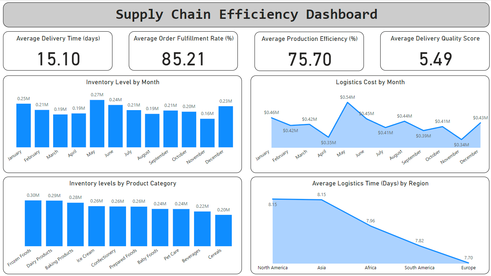

# Supply Chain Efficiency Dashboard

## Objective
To provide a comprehensive view of supply chain efficiency metrics to optimize inventory management, supplier performance, logistics, production, and order fulfillment.

## Stakeholders
- **Supply Chain Managers**: To monitor and improve supply chain processes.
- **Logistics Teams**: To manage and optimize logistics costs and times.
- **Production Managers**: To track and enhance production efficiency.
- **Procurement Teams**: To evaluate and improve supplier performance.

## Business Problems
- **Inventory Management**: Difficulty in optimizing inventory levels and turnover rates.
- **Supplier Performance**: Challenges in tracking and improving supplier delivery times and quality.
- **Logistics Optimization**: High logistics costs and inefficiencies in delivery times.
- **Production Efficiency**: Need to monitor and enhance production efficiency.
- **Order Fulfillment**: Ensuring high order fulfillment rates to meet customer expectations.

## Data Source
Generated sample data using Python with key metrics and dimensions necessary for supply chain efficiency analysis.

## Results
- **Inventory Analysis**: Insights into inventory levels and turnover rates.
- **Supplier Performance**: Evaluation of supplier delivery times and quality scores.
- **Logistics Costs and Times**: Analysis of logistics costs and times.
- **Production Efficiency**: Monitoring of production efficiency percentages.
- **Order Fulfillment**: Visualization of order fulfillment rates.

This project demonstrates the application of data analytics and visualization techniques to gain valuable insights into supply chain efficiency, showcasing the ability to generate, analyze, and visualize data for improved decision-making in supply chain management.