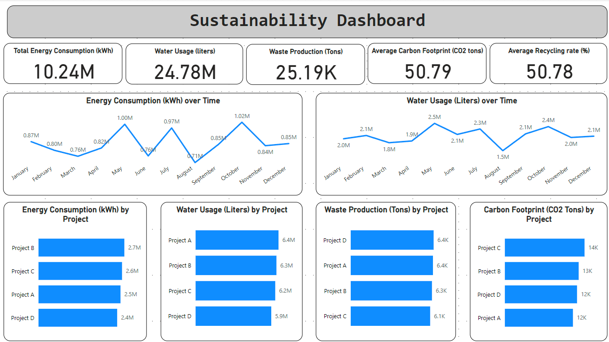

## Project Title: Sustainability Dashboard

### Project Description

The Sustainability Dashboard is a comprehensive data visualization project aimed at providing actionable insights into various sustainability metrics. This project tracks key metrics such as energy consumption, water usage, waste production, recycling rates, carbon footprint, and sustainability project progress. The dashboard is designed to help stakeholders monitor and improve sustainability initiatives, identify areas for improvement, and make informed decisions to drive environmental and economic benefits.

### Objectives

1. **Monitor Energy Consumption**:
   - Track energy usage over time to identify patterns, peaks, and areas for potential energy savings.
   
2. **Analyze Water Usage**:
   - Measure water consumption to ensure efficient usage and identify opportunities for conservation.
   
3. **Track Waste Production and Recycling Rates**:
   - Monitor waste production and recycling rates to improve waste management practices and increase recycling efforts.
   
4. **Assess Carbon Footprint**:
   - Calculate and analyze carbon footprint to understand and reduce the environmental impact of operations.
   
5. **Evaluate Sustainability Project Progress**:
   - Track the progress of sustainability projects to ensure timely completion and effectiveness in meeting sustainability goals.

### Stakeholders

- **Sustainability Teams**:
  - Use insights to optimize sustainability initiatives and track progress against goals.
  
- **Facility Managers**:
  - Monitor energy and water usage, waste production, and recycling rates to improve facility operations.
  
- **Environmental Compliance Officers**:
  - Ensure compliance with environmental regulations by tracking key sustainability metrics.
  
- **Executive Management**:
  - Gain a high-level overview of sustainability performance to guide strategic decision-making.
  
- **Investors and Analysts**:
  - Assess the effectiveness of sustainability initiatives to inform investment decisions and corporate evaluations.

### Business Problems

1. **High Energy Consumption**:
   - Difficulty in tracking and reducing energy usage leading to high operational costs and environmental impact.
   
2. **Excessive Water Usage**:
   - Inefficient water usage causing unnecessary expenses and potential regulatory issues.
   
3. **Waste Management Challenges**:
   - High levels of waste production with low recycling rates affecting environmental sustainability and compliance.
   
4. **Unclear Carbon Footprint**:
   - Lack of visibility into carbon emissions making it difficult to implement reduction strategies.
   
5. **Sustainability Project Delays**:
   - Poor tracking of sustainability project progress causing delays and reduced effectiveness.

### Results

- **Reduced Energy Consumption**:
  - Identification of energy-saving opportunities leading to reduced operational costs and environmental impact.
  
- **Optimized Water Usage**:
  - Improved water management practices resulting in efficient usage and cost savings.
  
- **Enhanced Waste Management**:
  - Increased recycling rates and reduced waste production improving environmental sustainability and compliance.
  
- **Lowered Carbon Footprint**:
  - Effective tracking and reduction of carbon emissions contributing to environmental goals and regulatory compliance.
  
- **Timely Project Completion**:
  - Efficient tracking and management of sustainability projects ensuring timely completion and achieving sustainability targets.

### Key Visualizations

1. **Energy Consumption Over Time (Line Chart)**:
   - Visualizes energy usage trends over time to identify patterns and peaks.

2. **Water Usage Over Time (Line Chart)**:
   - Shows water consumption trends over time to ensure efficient usage.

3. **Waste Production and Recycling Rates (Bar Chart)**:
   - Displays waste production and recycling rates to improve waste management practices.

4. **Project Progress (Progress Bar)**:
   - Visualizes the progress of sustainability projects to ensure timely completion.

### Conclusion

The Sustainability Dashboard provides a powerful tool for visualizing and analyzing key sustainability metrics. By offering actionable insights into energy consumption, water usage, waste production, recycling rates, carbon footprint, and project progress, this project enables stakeholders to optimize their sustainability initiatives and drive environmental and economic benefits. The comprehensive approach and user-friendly visualizations make it an invaluable resource for sustainability teams, facility managers, environmental compliance officers, executive management, and investors.